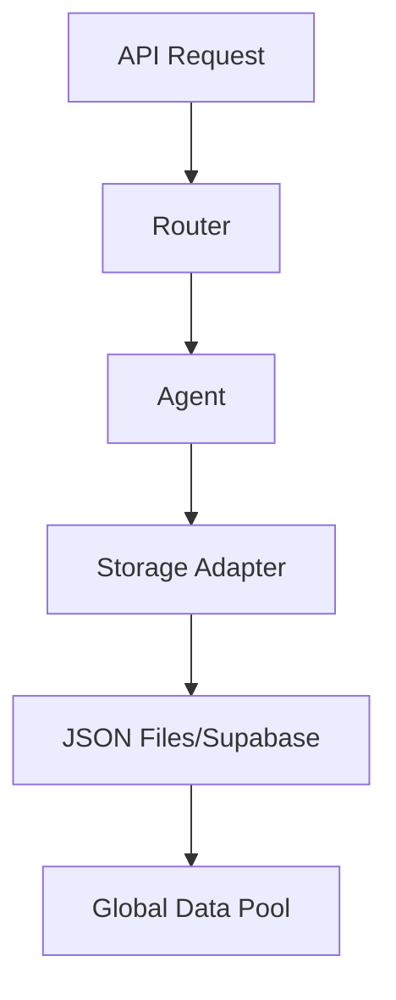
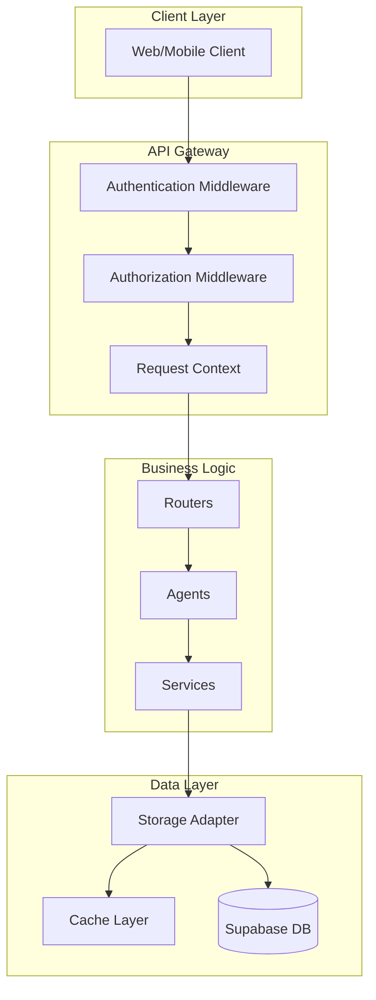
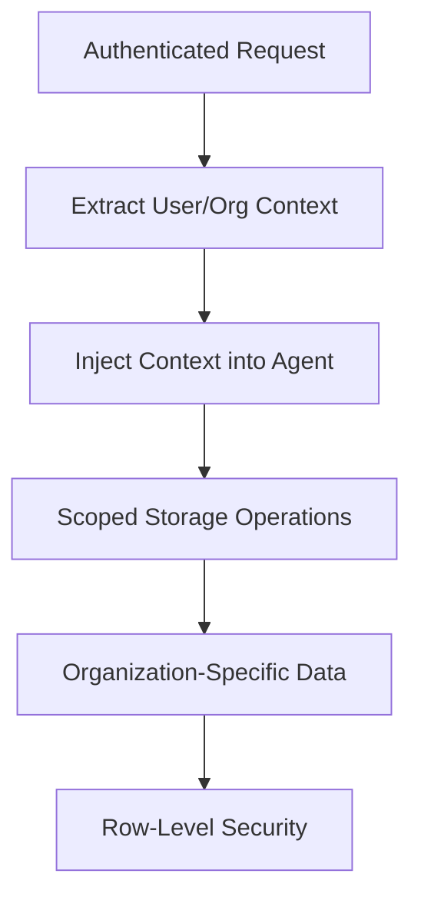
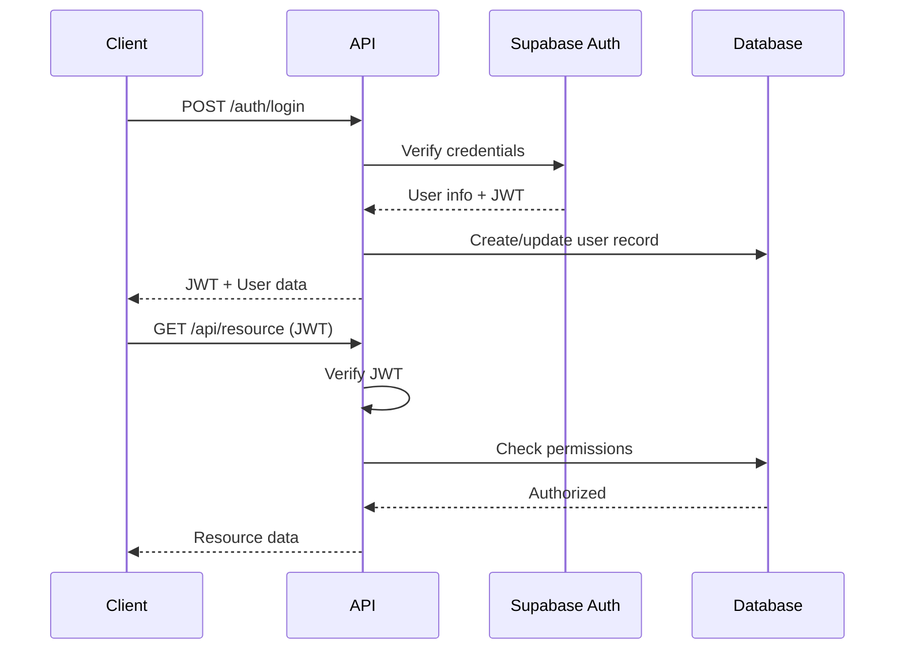
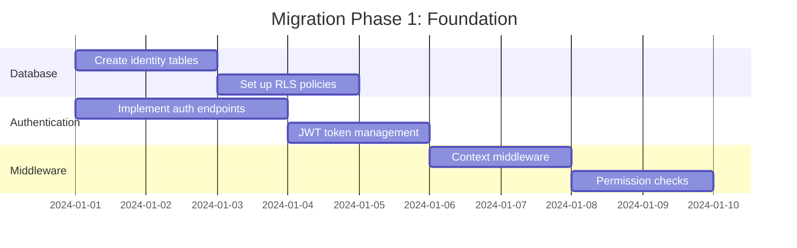
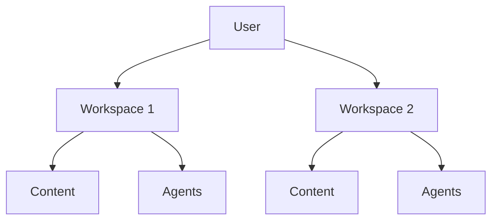
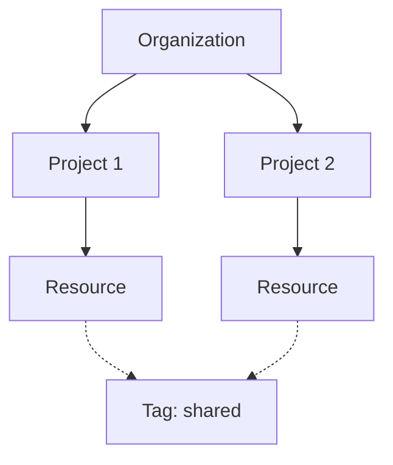

# Multi-Tenant Organization and Project Scoping System Design

## Executive Summary

This document outlines a comprehensive plan to transform the 7cycles-ai system from a single-tenant application to a robust multi-tenant platform with organization and project scoping capabilities. The design introduces proper user authentication, role-based access control (RBAC), and data isolation while maintaining backward compatibility and system performance.

## Table of Contents

1. [Current System Analysis](#current-system-analysis)
2. [Proposed Architecture](#proposed-architecture)
3. [Database Schema Design](#database-schema-design)
4. [Authentication & Authorization](#authentication--authorization)
5. [API Changes](#api-changes)
6. [Agent Modifications](#agent-modifications)
7. [Security Implementation](#security-implementation)
8. [Migration Strategy](#migration-strategy)
9. [Performance Considerations](#performance-considerations)
10. [Alternative Approaches](#alternative-approaches)
11. [Implementation Phases](#implementation-phases)
12. [Risk Assessment](#risk-assessment)

## Current System Analysis

### Strengths
- **Modular agent architecture**: CrewAI-based agents are well-separated
- **Storage abstraction layer**: Already has base interfaces for storage adapters
- **Supabase integration**: Initial setup for database storage exists
- **API structure**: Clean FastAPI implementation with routers

### Weaknesses
- **No authentication**: System currently has no user authentication
- **No data isolation**: All data is globally accessible
- **File-based storage**: Still primarily uses JSON files
- **No user context**: Agents operate without user/organization context
- **Single tenant**: No concept of organizations or projects

### Current Data Flow


## Proposed Architecture

### High-Level Architecture


### Multi-Tenant Data Flow


## Database Schema Design

### Core Identity Tables

```sql
-- Organizations
CREATE TABLE organizations (
    id UUID PRIMARY KEY DEFAULT gen_random_uuid(),
    name TEXT NOT NULL,
    slug TEXT UNIQUE NOT NULL,
    description TEXT,
    settings JSONB DEFAULT '{}',
    subscription_tier TEXT DEFAULT 'free',
    subscription_status TEXT DEFAULT 'active',
    created_at TIMESTAMP DEFAULT NOW(),
    updated_at TIMESTAMP DEFAULT NOW(),
    deleted_at TIMESTAMP,
    INDEX idx_slug (slug),
    INDEX idx_status (subscription_status)
);

-- Projects within organizations
CREATE TABLE projects (
    id UUID PRIMARY KEY DEFAULT gen_random_uuid(),
    organization_id UUID NOT NULL REFERENCES organizations(id) ON DELETE CASCADE,
    name TEXT NOT NULL,
    slug TEXT NOT NULL,
    description TEXT,
    settings JSONB DEFAULT '{}',
    is_active BOOLEAN DEFAULT true,
    created_at TIMESTAMP DEFAULT NOW(),
    updated_at TIMESTAMP DEFAULT NOW(),
    deleted_at TIMESTAMP,
    UNIQUE(organization_id, slug),
    INDEX idx_org_slug (organization_id, slug),
    INDEX idx_active (is_active)
);

-- Users
CREATE TABLE users (
    id UUID PRIMARY KEY DEFAULT gen_random_uuid(),
    email TEXT UNIQUE NOT NULL,
    name TEXT NOT NULL,
    avatar_url TEXT,
    auth_provider TEXT DEFAULT 'email',
    auth_provider_id TEXT,
    email_verified BOOLEAN DEFAULT false,
    settings JSONB DEFAULT '{}',
    last_login_at TIMESTAMP,
    created_at TIMESTAMP DEFAULT NOW(),
    updated_at TIMESTAMP DEFAULT NOW(),
    deleted_at TIMESTAMP,
    INDEX idx_email (email),
    INDEX idx_provider (auth_provider, auth_provider_id)
);

-- Organization memberships
CREATE TABLE organization_members (
    id UUID PRIMARY KEY DEFAULT gen_random_uuid(),
    organization_id UUID NOT NULL REFERENCES organizations(id) ON DELETE CASCADE,
    user_id UUID NOT NULL REFERENCES users(id) ON DELETE CASCADE,
    role TEXT NOT NULL DEFAULT 'member', -- owner, admin, member, viewer
    invited_by UUID REFERENCES users(id),
    invited_at TIMESTAMP DEFAULT NOW(),
    accepted_at TIMESTAMP,
    created_at TIMESTAMP DEFAULT NOW(),
    updated_at TIMESTAMP DEFAULT NOW(),
    UNIQUE(organization_id, user_id),
    INDEX idx_org_user (organization_id, user_id),
    INDEX idx_user_orgs (user_id),
    INDEX idx_role (role)
);

-- Project memberships (optional - can inherit from org)
CREATE TABLE project_members (
    id UUID PRIMARY KEY DEFAULT gen_random_uuid(),
    project_id UUID NOT NULL REFERENCES projects(id) ON DELETE CASCADE,
    user_id UUID NOT NULL REFERENCES users(id) ON DELETE CASCADE,
    role TEXT NOT NULL DEFAULT 'member',
    permissions JSONB DEFAULT '{}',
    created_at TIMESTAMP DEFAULT NOW(),
    updated_at TIMESTAMP DEFAULT NOW(),
    UNIQUE(project_id, user_id),
    INDEX idx_project_user (project_id, user_id),
    INDEX idx_user_projects (user_id)
);

-- API Keys for programmatic access
CREATE TABLE api_keys (
    id UUID PRIMARY KEY DEFAULT gen_random_uuid(),
    organization_id UUID NOT NULL REFERENCES organizations(id) ON DELETE CASCADE,
    project_id UUID REFERENCES projects(id) ON DELETE CASCADE,
    name TEXT NOT NULL,
    key_hash TEXT NOT NULL UNIQUE,
    key_prefix TEXT NOT NULL, -- First 8 chars for identification
    permissions JSONB DEFAULT '{}',
    last_used_at TIMESTAMP,
    expires_at TIMESTAMP,
    created_by UUID NOT NULL REFERENCES users(id),
    created_at TIMESTAMP DEFAULT NOW(),
    revoked_at TIMESTAMP,
    INDEX idx_key_prefix (key_prefix),
    INDEX idx_org (organization_id),
    INDEX idx_expires (expires_at)
);

-- Audit log
CREATE TABLE audit_logs (
    id UUID PRIMARY KEY DEFAULT gen_random_uuid(),
    organization_id UUID REFERENCES organizations(id) ON DELETE SET NULL,
    project_id UUID REFERENCES projects(id) ON DELETE SET NULL,
    user_id UUID REFERENCES users(id) ON DELETE SET NULL,
    action TEXT NOT NULL,
    resource_type TEXT NOT NULL,
    resource_id UUID,
    ip_address INET,
    user_agent TEXT,
    metadata JSONB DEFAULT '{}',
    created_at TIMESTAMP DEFAULT NOW(),
    INDEX idx_org (organization_id),
    INDEX idx_user (user_id),
    INDEX idx_resource (resource_type, resource_id),
    INDEX idx_created (created_at)
);
```

### Modified Agent Tables (with scoping)

All existing agent tables need to be modified to include organization and project context:

```sql
-- Example: Modified affirmations table
CREATE TABLE agent_affirmation_items (
    id UUID PRIMARY KEY DEFAULT gen_random_uuid(),
    organization_id UUID NOT NULL REFERENCES organizations(id) ON DELETE CASCADE,
    project_id UUID REFERENCES projects(id) ON DELETE CASCADE,
    theme TEXT NOT NULL,
    period INTEGER NOT NULL,
    affirmation TEXT NOT NULL,
    language TEXT DEFAULT 'de',
    created_by UUID REFERENCES users(id),
    created_at TIMESTAMP DEFAULT NOW(),
    metadata JSONB,
    INDEX idx_org_project (organization_id, project_id),
    INDEX idx_period (period),
    INDEX idx_theme (theme)
);

-- Add RLS policies
ALTER TABLE agent_affirmation_items ENABLE ROW LEVEL SECURITY;

CREATE POLICY affirmation_org_isolation ON agent_affirmation_items
    FOR ALL USING (
        organization_id IN (
            SELECT organization_id FROM organization_members 
            WHERE user_id = auth.uid()
        )
    );
```

### Row-Level Security (RLS) Template

```sql
-- Template for all agent tables
CREATE POLICY {table}_org_isolation ON {table}
    FOR ALL USING (
        organization_id IN (
            SELECT organization_id FROM organization_members 
            WHERE user_id = auth.uid()
        )
        AND (
            project_id IS NULL 
            OR project_id IN (
                SELECT id FROM projects 
                WHERE organization_id = {table}.organization_id
                AND (
                    -- User has org-level access
                    EXISTS (
                        SELECT 1 FROM organization_members 
                        WHERE organization_id = projects.organization_id 
                        AND user_id = auth.uid()
                    )
                    OR
                    -- User has project-level access
                    EXISTS (
                        SELECT 1 FROM project_members 
                        WHERE project_id = projects.id 
                        AND user_id = auth.uid()
                    )
                )
            )
        )
    );
```

## Authentication & Authorization

### Authentication Flow



### Authorization Model (RBAC)

```python
from enum import Enum
from typing import List, Optional
from pydantic import BaseModel

class OrganizationRole(str, Enum):
    OWNER = "owner"
    ADMIN = "admin"
    MEMBER = "member"
    VIEWER = "viewer"

class Permission(str, Enum):
    # Organization permissions
    ORG_READ = "org:read"
    ORG_UPDATE = "org:update"
    ORG_DELETE = "org:delete"
    ORG_BILLING = "org:billing"
    
    # Project permissions
    PROJECT_CREATE = "project:create"
    PROJECT_READ = "project:read"
    PROJECT_UPDATE = "project:update"
    PROJECT_DELETE = "project:delete"
    
    # Agent permissions
    AGENT_USE = "agent:use"
    AGENT_CONFIGURE = "agent:configure"
    
    # Content permissions
    CONTENT_CREATE = "content:create"
    CONTENT_READ = "content:read"
    CONTENT_UPDATE = "content:update"
    CONTENT_DELETE = "content:delete"
    CONTENT_PUBLISH = "content:publish"

# Role-Permission Mapping
ROLE_PERMISSIONS = {
    OrganizationRole.OWNER: [Permission(p) for p in Permission],
    OrganizationRole.ADMIN: [
        Permission.ORG_READ, Permission.ORG_UPDATE,
        Permission.PROJECT_CREATE, Permission.PROJECT_READ, 
        Permission.PROJECT_UPDATE, Permission.PROJECT_DELETE,
        Permission.AGENT_USE, Permission.AGENT_CONFIGURE,
        Permission.CONTENT_CREATE, Permission.CONTENT_READ,
        Permission.CONTENT_UPDATE, Permission.CONTENT_DELETE,
        Permission.CONTENT_PUBLISH
    ],
    OrganizationRole.MEMBER: [
        Permission.ORG_READ,
        Permission.PROJECT_READ,
        Permission.AGENT_USE,
        Permission.CONTENT_CREATE, Permission.CONTENT_READ,
        Permission.CONTENT_UPDATE
    ],
    OrganizationRole.VIEWER: [
        Permission.ORG_READ,
        Permission.PROJECT_READ,
        Permission.CONTENT_READ
    ]
}
```

### JWT Token Structure

```json
{
  "sub": "user_uuid",
  "email": "user@example.com",
  "organizations": [
    {
      "id": "org_uuid",
      "role": "admin",
      "projects": ["project_uuid1", "project_uuid2"]
    }
  ],
  "permissions": ["org:read", "project:create", "agent:use"],
  "iat": 1234567890,
  "exp": 1234567890
}
```

## API Changes

### New Authentication Endpoints

```python
# app/api/routers/auth.py
from fastapi import APIRouter, Depends, HTTPException
from app.models.auth import LoginRequest, SignupRequest, TokenResponse

router = APIRouter(prefix="/auth", tags=["authentication"])

@router.post("/signup", response_model=TokenResponse)
async def signup(request: SignupRequest):
    """Create new user and organization"""
    pass

@router.post("/login", response_model=TokenResponse)
async def login(request: LoginRequest):
    """Authenticate user"""
    pass

@router.post("/refresh", response_model=TokenResponse)
async def refresh_token(refresh_token: str):
    """Refresh access token"""
    pass

@router.post("/logout")
async def logout(current_user = Depends(get_current_user)):
    """Invalidate user session"""
    pass
```

### Modified Existing Endpoints

All existing endpoints need to be modified to include authentication and scoping:

```python
# Example: Modified content generation endpoint
from app.core.auth import get_current_user, check_permission
from app.models.auth import User, RequestContext

@router.post("/content/generate")
async def generate_content(
    request: ContentRequest,
    context: RequestContext = Depends(get_request_context),
    current_user: User = Depends(get_current_user),
    _: None = Depends(check_permission(Permission.CONTENT_CREATE))
):
    """Generate content within organization/project context"""
    # Inject context into agent
    agent = get_agent('content_wrapper')
    agent.set_context(context)
    
    # Generate content with context
    result = await agent.generate(request)
    
    # Save with organization/project association
    await storage.save('content', {
        **result,
        'organization_id': context.organization_id,
        'project_id': context.project_id,
        'created_by': current_user.id
    })
    
    return result
```

### Request Context Middleware

```python
# app/core/middleware.py
from fastapi import Request, HTTPException
from app.core.auth import decode_token

class ContextMiddleware:
    async def __call__(self, request: Request, call_next):
        # Extract organization/project from headers or URL
        org_slug = request.headers.get('X-Organization')
        project_slug = request.headers.get('X-Project')
        
        # Or from URL path
        if not org_slug and '/orgs/' in str(request.url):
            # Extract from /orgs/{org_slug}/...
            pass
        
        # Set context
        request.state.organization_id = await get_org_id(org_slug)
        request.state.project_id = await get_project_id(project_slug)
        
        response = await call_next(request)
        return response
```

## Agent Modifications

### Base Agent Context

```python
# app/agents/crews/base_crew.py
from typing import Optional
from pydantic import BaseModel

class AgentContext(BaseModel):
    organization_id: str
    project_id: Optional[str] = None
    user_id: str
    permissions: List[str] = []

class BaseCrew:
    def __init__(self, *args, **kwargs):
        super().__init__(*args, **kwargs)
        self._context: Optional[AgentContext] = None
    
    def set_context(self, context: AgentContext):
        """Set organization/project context for the agent"""
        self._context = context
    
    def get_scoped_storage(self):
        """Get storage adapter with automatic scoping"""
        return ScopedStorageAdapter(
            self.storage_adapter,
            self._context
        )
    
    async def save_result(self, collection: str, data: dict):
        """Save data with automatic context injection"""
        storage = self.get_scoped_storage()
        return await storage.save(collection, {
            **data,
            'organization_id': self._context.organization_id,
            'project_id': self._context.project_id,
            'created_by': self._context.user_id
        })
```

### Scoped Storage Adapter

```python
# app/core/storage/scoped_adapter.py
class ScopedStorageAdapter(StorageAdapter):
    def __init__(self, base_adapter: StorageAdapter, context: AgentContext):
        self.base_adapter = base_adapter
        self.context = context
    
    async def save(self, collection: str, data: Dict[str, Any], id: Optional[str] = None) -> str:
        # Inject context
        scoped_data = {
            **data,
            'organization_id': self.context.organization_id,
            'project_id': self.context.project_id
        }
        return await self.base_adapter.save(collection, scoped_data, id)
    
    async def list(self, collection: str, filters: Optional[Dict] = None, **kwargs) -> List[Dict[str, Any]]:
        # Add context filters
        scoped_filters = {
            **(filters or {}),
            'organization_id': self.context.organization_id
        }
        if self.context.project_id:
            scoped_filters['project_id'] = self.context.project_id
        
        return await self.base_adapter.list(collection, scoped_filters, **kwargs)
```

### Modified Agent Example

```python
# app/agents/qa_agent.py
class QAAgent(BaseCrew):
    async def ask_question(self, question: str) -> str:
        # Use scoped knowledge base
        knowledge_base = await self.get_scoped_knowledge_base()
        
        # Generate answer
        answer = await self._generate_answer(question, knowledge_base)
        
        # Save interaction with context
        await self.save_result('qa_interactions', {
            'question': question,
            'answer': answer,
            'timestamp': datetime.utcnow()
        })
        
        return answer
    
    async def get_scoped_knowledge_base(self):
        """Get organization/project specific knowledge base"""
        storage = self.get_scoped_storage()
        
        # Load organization-specific documents
        org_docs = await storage.list('knowledge_documents', {
            'organization_id': self._context.organization_id,
            'project_id': None  # Org-level docs
        })
        
        # Load project-specific documents if in project context
        project_docs = []
        if self._context.project_id:
            project_docs = await storage.list('knowledge_documents', {
                'project_id': self._context.project_id
            })
        
        return org_docs + project_docs
```

## Security Implementation

### 1. API Key Management

```python
# app/core/security/api_keys.py
import secrets
import hashlib
from typing import Optional

class APIKeyManager:
    @staticmethod
    def generate_api_key() -> tuple[str, str]:
        """Generate API key and its hash"""
        key = f"7c_{secrets.token_urlsafe(32)}"
        key_hash = hashlib.sha256(key.encode()).hexdigest()
        return key, key_hash
    
    @staticmethod
    async def validate_api_key(key: str) -> Optional[dict]:
        """Validate API key and return permissions"""
        key_hash = hashlib.sha256(key.encode()).hexdigest()
        
        # Look up in database
        api_key_record = await db.fetch_one(
            "SELECT * FROM api_keys WHERE key_hash = $1 AND revoked_at IS NULL",
            key_hash
        )
        
        if not api_key_record:
            return None
        
        # Check expiration
        if api_key_record['expires_at'] and api_key_record['expires_at'] < datetime.utcnow():
            return None
        
        # Update last used
        await db.execute(
            "UPDATE api_keys SET last_used_at = NOW() WHERE id = $1",
            api_key_record['id']
        )
        
        return {
            'organization_id': api_key_record['organization_id'],
            'project_id': api_key_record['project_id'],
            'permissions': api_key_record['permissions']
        }
```

### 2. Rate Limiting

```python
# app/core/security/rate_limit.py
from fastapi import Request, HTTPException
from slowapi import Limiter
from slowapi.util import get_remote_address

# Create limiter
limiter = Limiter(key_func=get_remote_address)

# Organization-based rate limiting
def get_org_rate_limit_key(request: Request):
    return f"{request.state.organization_id}:{get_remote_address(request)}"

# Apply different limits based on subscription tier
@limiter.limit("100/hour", key_func=get_org_rate_limit_key)
async def rate_limited_endpoint(request: Request):
    pass
```

### 3. Data Encryption

```python
# app/core/security/encryption.py
from cryptography.fernet import Fernet
import base64

class EncryptionService:
    def __init__(self, key: str):
        self.cipher = Fernet(base64.urlsafe_b64encode(key.encode()[:32]))
    
    def encrypt_sensitive_field(self, data: str) -> str:
        """Encrypt sensitive data before storage"""
        return self.cipher.encrypt(data.encode()).decode()
    
    def decrypt_sensitive_field(self, encrypted_data: str) -> str:
        """Decrypt sensitive data after retrieval"""
        return self.cipher.decrypt(encrypted_data.encode()).decode()
```

## Migration Strategy

### Phase 1: Foundation (Week 1-2)



1. **Database Setup**
   ```sql
   -- Run migration script
   psql $DATABASE_URL < migrations/001_add_multi_tenancy.sql
   ```

2. **Authentication Service**
   ```python
   # app/services/auth_service.py
   class AuthService:
       async def create_user_with_org(self, email: str, password: str, org_name: str):
           # Create user
           user = await self.create_user(email, password)
           
           # Create organization
           org = await self.create_organization(org_name, user.id)
           
           # Add user as owner
           await self.add_org_member(org.id, user.id, "owner")
           
           return user, org
   ```

3. **Update Configuration**
   ```python
   # app/core/config.py
   # Auth settings
   JWT_SECRET_KEY = os.getenv("JWT_SECRET_KEY")
   JWT_ALGORITHM = "HS256"
   JWT_EXPIRATION_HOURS = 24
   
   # Multi-tenancy settings
   ENABLE_MULTI_TENANCY = os.getenv("ENABLE_MULTI_TENANCY", "false") == "true"
   DEFAULT_ORG_SLUG = "default"  # For backward compatibility
   ```

### Phase 2: Agent Migration (Week 3-4)

1. **Update Base Agent**
   - Add context support
   - Implement scoped storage
   - Add backward compatibility

2. **Migrate Simple Agents First**
   - QA Agent
   - Affirmations Agent
   - Image Generator

3. **Test Each Migration**
   ```python
   # tests/test_multi_tenant_agents.py
   async def test_agent_data_isolation():
       # Create two organizations
       org1 = await create_test_org("org1")
       org2 = await create_test_org("org2")
       
       # Create content in org1
       agent1 = QAAgent()
       agent1.set_context(AgentContext(organization_id=org1.id))
       await agent1.ask_question("Test question")
       
       # Verify org2 can't see it
       agent2 = QAAgent()
       agent2.set_context(AgentContext(organization_id=org2.id))
       interactions = await agent2.get_interactions()
       assert len(interactions) == 0
   ```

### Phase 3: API Migration (Week 5-6)

1. **Add Authentication to Endpoints**
   ```python
   # Gradual migration with feature flag
   if settings.ENABLE_MULTI_TENANCY:
       router.include_router(auth_router)
       app.add_middleware(ContextMiddleware)
   ```

2. **Update Frontend Integration**
   - Add authentication flow
   - Include auth headers
   - Handle organization/project selection

### Phase 4: Data Migration (Week 7)

```python
# scripts/migrate_existing_data.py
async def migrate_to_multi_tenant():
    # Create default organization
    default_org = await create_organization("Default Organization")
    
    # Migrate each collection
    for collection in COLLECTIONS:
        items = await old_storage.list(collection)
        for item in items:
            item['organization_id'] = default_org.id
            await new_storage.save(collection, item)
```

## Performance Considerations

### 1. Database Indexing Strategy

```sql
-- Composite indexes for common queries
CREATE INDEX idx_content_org_project_created 
ON agent_content_items(organization_id, project_id, created_at DESC);

CREATE INDEX idx_posts_org_status 
ON agent_instagram_posts(organization_id, status);

-- Partial indexes for active records
CREATE INDEX idx_projects_active 
ON projects(organization_id) 
WHERE is_active = true AND deleted_at IS NULL;
```

### 2. Caching Strategy

```python
# app/core/cache.py
from redis import Redis
import json

class CacheService:
    def __init__(self, redis_client: Redis):
        self.redis = redis_client
    
    async def get_org_permissions(self, user_id: str, org_id: str) -> Optional[List[str]]:
        """Cache user permissions per organization"""
        key = f"perms:{user_id}:{org_id}"
        cached = await self.redis.get(key)
        if cached:
            return json.loads(cached)
        
        # Load from database
        perms = await load_user_permissions(user_id, org_id)
        
        # Cache for 5 minutes
        await self.redis.setex(key, 300, json.dumps(perms))
        return perms
```

### 3. Query Optimization

```python
# Use database views for complex queries
CREATE VIEW user_organization_access AS
SELECT 
    u.id as user_id,
    o.id as org_id,
    o.slug as org_slug,
    om.role,
    ARRAY_AGG(DISTINCT p.id) as project_ids
FROM users u
JOIN organization_members om ON u.id = om.user_id
JOIN organizations o ON om.organization_id = o.id
LEFT JOIN project_members pm ON u.id = pm.user_id
LEFT JOIN projects p ON pm.project_id = p.id
WHERE u.deleted_at IS NULL 
  AND o.deleted_at IS NULL
GROUP BY u.id, o.id, om.role;
```

### 4. Connection Pooling

```python
# app/core/database.py
from databases import Database

database = Database(
    settings.DATABASE_URL,
    min_size=10,
    max_size=50,
    command_timeout=60,
    pool_recycle=3600
)
```

## Alternative Approaches

### Alternative 1: Workspace-Based Model

Instead of Organizations → Projects, use a simpler Workspace model:



**Pros:**
- Simpler mental model
- Easier to implement
- Less nesting complexity

**Cons:**
- Less flexibility for large organizations
- Harder to share resources across projects

### Alternative 2: Tag-Based Scoping

Use tags instead of rigid hierarchy:

```sql
CREATE TABLE resource_tags (
    resource_id UUID,
    resource_type TEXT,
    tag_key TEXT,
    tag_value TEXT,
    PRIMARY KEY (resource_id, tag_key)
);
```

**Pros:**
- Very flexible
- Easy cross-project sharing
- Simple implementation

**Cons:**
- Harder to enforce security
- Can become messy
- Performance concerns with many tags

### Alternative 3: Hybrid Approach

Combine hierarchical structure with tags:



**Recommendation:** Start with the hierarchical Organization → Project model as it provides clear boundaries and security, then add tags later for flexibility.

## Implementation Phases

### Phase 1: Core Infrastructure (2 weeks)
- [ ] Set up authentication system
- [ ] Create database schema
- [ ] Implement RLS policies
- [ ] Build context middleware
- [ ] Create permission system

### Phase 2: Storage Layer (1 week)
- [ ] Implement scoped storage adapter
- [ ] Update storage factory
- [ ] Add multi-tenant support to Supabase adapter
- [ ] Create migration utilities

### Phase 3: Agent Updates (2 weeks)
- [ ] Update base agent class
- [ ] Migrate QA agent (pilot)
- [ ] Migrate remaining agents
- [ ] Update agent tests

### Phase 4: API Migration (2 weeks)
- [ ] Add auth endpoints
- [ ] Update existing endpoints
- [ ] Implement rate limiting
- [ ] Add API documentation

### Phase 5: Data Migration (1 week)
- [ ] Create migration scripts
- [ ] Set up default organization
- [ ] Migrate existing data
- [ ] Verify data integrity

### Phase 6: Testing & Deployment (1 week)
- [ ] Comprehensive testing
- [ ] Performance testing
- [ ] Security audit
- [ ] Staged rollout

## Risk Assessment

### High Risk Items
1. **Data Loss During Migration**
   - Mitigation: Comprehensive backups, dry runs, rollback procedures

2. **Performance Degradation**
   - Mitigation: Load testing, caching, query optimization

3. **Security Vulnerabilities**
   - Mitigation: Security audit, penetration testing, code review

### Medium Risk Items
1. **User Experience Disruption**
   - Mitigation: Feature flags, gradual rollout, clear communication

2. **Integration Complexity**
   - Mitigation: Comprehensive documentation, client SDKs

### Low Risk Items
1. **Backward Compatibility**
   - Mitigation: Deprecation warnings, migration guides

## Success Metrics

1. **Security**
   - Zero unauthorized data access incidents
   - 100% of endpoints protected by authentication
   - All sensitive data encrypted at rest

2. **Performance**
   - API response time < 200ms (p95)
   - Database query time < 50ms (p95)
   - 99.9% uptime

3. **Adoption**
   - 100% of existing users migrated
   - 90% user satisfaction with new features
   - < 5% increase in support tickets

## Conclusion

This multi-tenant architecture provides a solid foundation for scaling the 7cycles-ai platform while maintaining security, performance, and flexibility. The phased approach minimizes risk and allows for continuous validation at each step.

The key innovations include:
- Hierarchical organization/project structure
- Row-level security for data isolation
- Flexible permission system
- Backward compatibility
- Performance optimization strategies

By following this plan, the system will be ready to support multiple organizations with proper data isolation, security, and scalability.